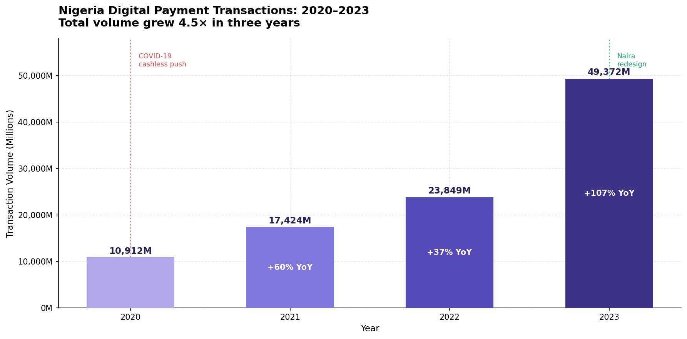
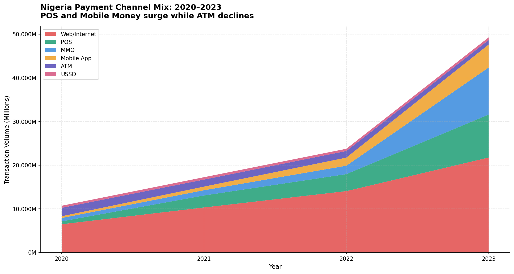
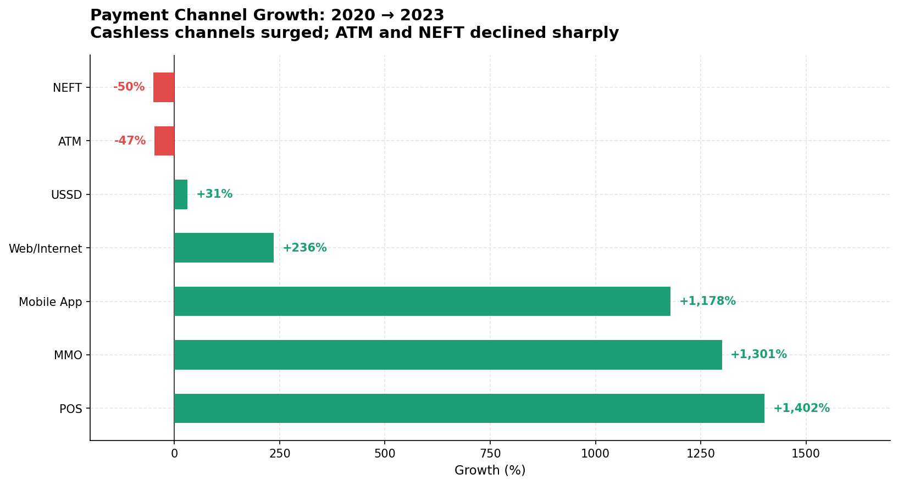
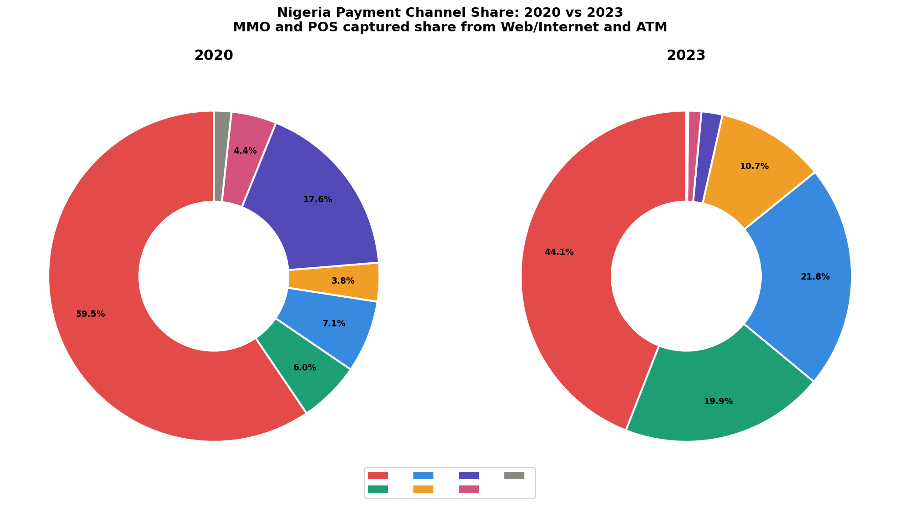
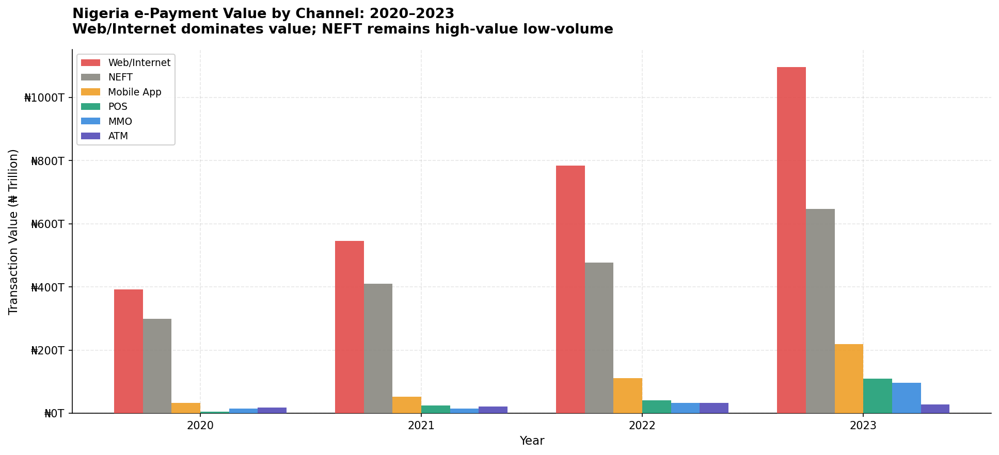
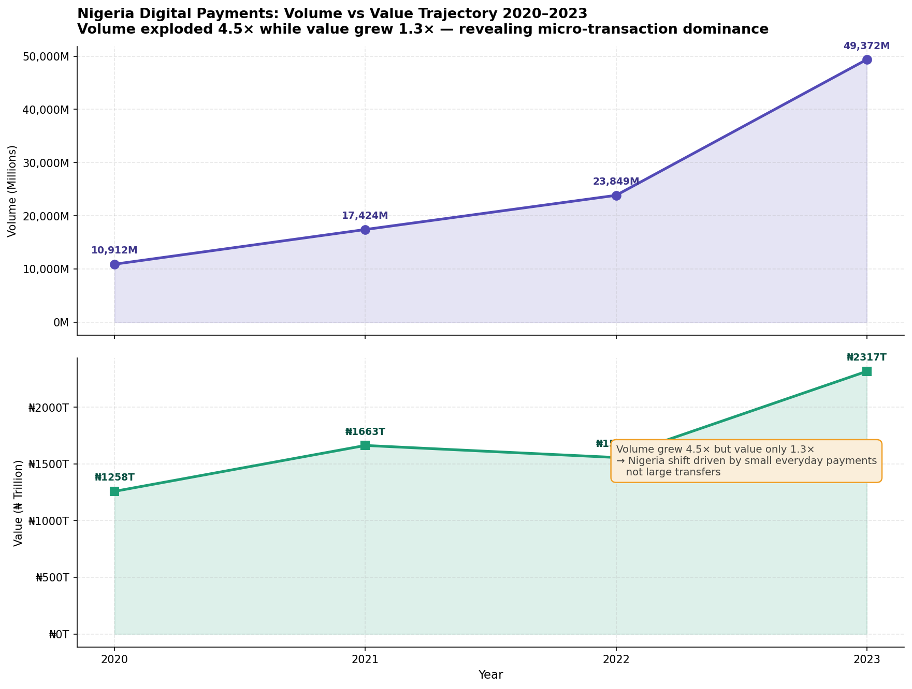

# nigeria-fintech-analysis
# Nigeria Digital Payments Analysis (2020–2023)

A data-driven analysis of Nigeria's e-payment ecosystem using official 
Central Bank of Nigeria (CBN) transaction data across 8 payment channels.

## Key Findings

- Total digital transaction volume grew **350%** from 10.9B (2020) to 49.4B (2023)
- **POS terminals surged +1,402%** driven by the 2023 naira redesign policy
- **Mobile Money Operators (MMO) grew +1,301%** — validating CBN's agent banking framework
- **ATM usage fell -47%** as consumers shifted to digital-first channels
- The 2023 naira scarcity crisis was the single largest accelerant of cashless adoption

## Visualisations

| Chart | Description |
|-------|-------------|
|  | Total volume growth 2020–2023 |
|  | Channel mix over time |
|  | Channel growth rates |
|  | Market share 2020 vs 2023 |
|  | Transaction value by channel |
|  | Volume vs value divergence |

## Data Source

- **Central Bank of Nigeria** — [e-Payment Statistics](https://www.cbn.gov.ng/PaymentsSystem/ePaymentStatistics.html)
- Period: January 2020 – December 2023 (full year figures)
- Note: 2024 data is H1 only and excluded from year-on-year comparisons

## Tools Used

`Python` `pandas` `matplotlib` `seaborn` `Jupyter Notebook`

## Project Structure

## Author

Nanaquame1 | Data Analytics Portfolio Project | April 2026